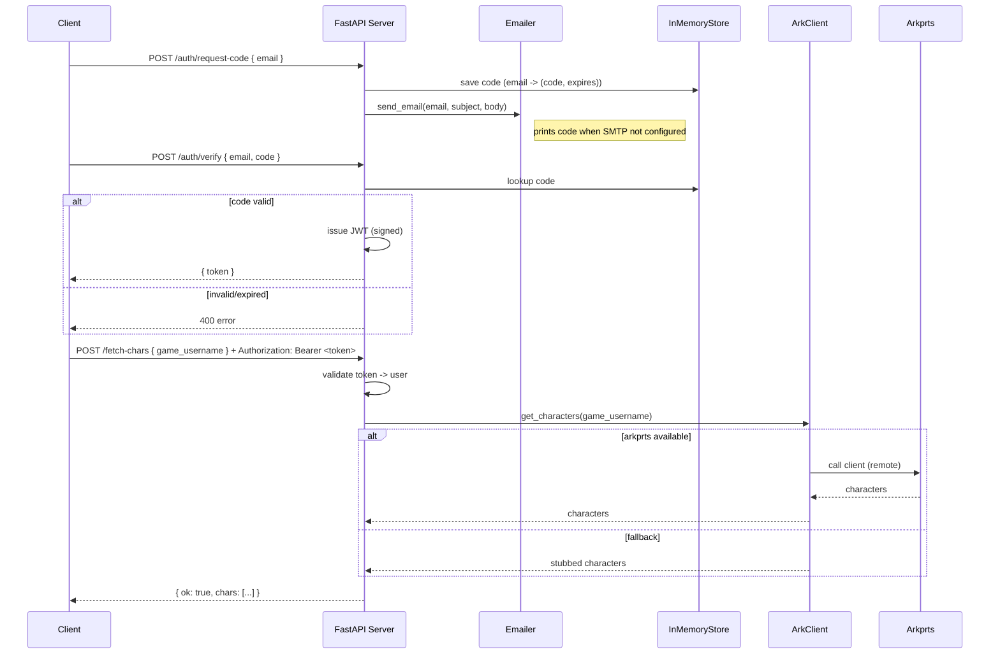

# Server architecture and request flow

This file documents the small FastAPI server using two diagrams (component and
sequence) rendered with Mermaid. It covers the email-code auth flow and the
protected `/fetch-chars` route which either calls `arkprts` or returns a
development stub.

## Component diagram (Mermaid)

```mermaid
graph TD
  Client[Client (browser/cli)] -->|POST /auth/request-code| Server[FastAPI app]
  Server -->|send_email()| Emailer[Emailer (SMTP or stdout)]
  Server -->|store code| InMemoryStore[(In-memory store: codes/users)]
  Client -->|POST /auth/verify| Server
  Server -->|issue JWT| JWT[JWT signed with JWT_SECRET]
  Client -->|POST /fetch-chars| Server
  Server -->|get_characters()| ArkClient[ark_client wrapper]
  ArkClient -->|arkprts (optional)| Arkprts[arkprts package or remote API]
  ArkClient -->|fallback| Stub[Stubbed chars list]

  style InMemoryStore fill:#f9f,stroke:#333,stroke-width:1px
```

## Sequence diagram (Mermaid)



If you prefer a PNG/SVG export, I can generate one and add it to the repo. I can
also add this diagram to the top-level README if you'd like it visible from the
project root.
